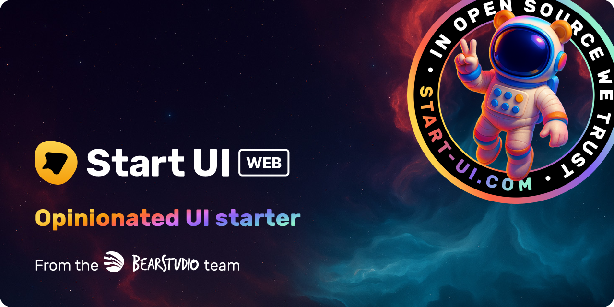
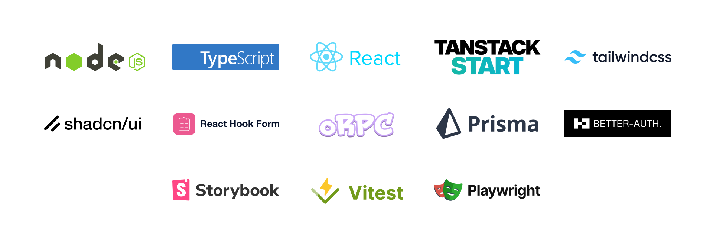

<h1 align="center"></h1>

🧠 **Francis Habits** - Système de Coaching IA basé sur les principes d'Atomic Habits

Une application web moderne pour créer, tracker et améliorer vos habitudes avec un coaching IA intelligent.

🧠 **Francis Habits** is an AI-powered habit coaching system based on the principles of Atomic Habits.

A modern web application to create, track, and improve your habits with intelligent AI coaching.


## Technologies

<div align="center" style="margin: 0 0 16px 0"></div>

[⚙️ Node.js](https://nodejs.org), [🟦 TypeScript](https://www.typescriptlang.org/), [⚛️ React](https://react.dev/), [📦 TanStack Start](https://tanstack.com/start), [💨 Tailwind CSS](https://tailwindcss.com/), [🧩 shadcn/ui](https://ui.shadcn.com/), [📋 React Hook Form](https://react-hook-form.com/), [🔌 oRPC](https://orpc.unnoq.com/), [🛠 Prisma](https://www.prisma.io/), [🔐 Better Auth](https://www.better-auth.com/), [📚 Storybook](https://storybook.js.org/), [🧪 Vitest](https://vitest.dev/), [🎭 Playwright](https://playwright.dev/)

## 🎯 Key Features

### Based on Atomic Habits Principles

- **Identity-Based Habits**: Define who you want to become, not just what you want to achieve
- **Habit Stacking**: Link new habits to existing ones for easier adoption
- **Environment Design**: Optimize your surroundings to make good habits obvious
- **The 4 Laws of Behavior Change**:
  - Make it obvious
  - Make it attractive
  - Make it easy
  - Make it satisfying
- **Habit Tracking**: Daily tracking with streaks and completion rates
- **Never Miss Twice**: Smart notifications to prevent habit decline

### AI-Powered Coaching

- **Pattern Recognition**: Analyze your habits to find optimal days and times
- **Personalized Recommendations**: Actionable suggestions based on your data
- **Atomic Habits Compliance Score**: See how well your habits align with principles
- **Smart Insights**: Get context-aware notifications and tips
- **Predictive Analysis**: Identify potential habit failures before they happen

### Core Functionality

- 📝 **Create & Manage Habits**: Full CRUD with Atomic Habits fields
- 📅 **Daily Tracking**: Toggle completion with visual feedback
- 📊 **Statistics**: Detailed charts showing progress and trends
- 🗓️ **Calendar View**: Monthly heatmap of habit completions
- 🧠 **AI Coaching**: Personalized insights and recommendations
- 🔔 **Smart Reminders**: Customizable push/email reminders
- 📤 **Data Export**: Export your data in JSON or CSV format
- 🌍 **Multi-language**: English, Arabic, French, Swahili
- 🌓 **Dark Mode**: Full dark mode support

### What's NOT in MVP

❌ No heavy gamification (badges, levels, points)
❌ No social network features
❌ No inspirational-only features (everything is measurable)

## Documentation

### Francis Habits Project Documentation

This project includes comprehensive documentation for the AI-powered habit coaching system:

- **[ARCHITECTURE.md](./ARCHITECTURE.md)** - System architecture and technical design
- **[DATA_MODEL.md](./DATA_MODEL.md)** - Complete database schema and data models
- **[API_ENDPOINTS.md](./API_ENDPOINTS.md)** - All API endpoints with TypeScript types
- **[DEVELOPMENT_PLAN.md](./DEVELOPMENT_PLAN.md)** - Development phases and milestones (MVP → v2 → v3)
- **[PROJECT_SKELETON.md](./PROJECT_SKELETON.md)** - Complete file structure and implementation guide
- **[AGENTS.md](./AGENTS.md)** - Development guidelines and coding standards

### General Start UI Documentation

For detailed information on the base project stack, please refer to the [documentation](https://docs.web.start-ui.com). The documentation contains all the necessary information on installation, usage, and some guides.

## Requirements

* [Node.js](https://nodejs.org) >= 22
* [pnpm](https://pnpm.io/)
* [Docker](https://www.docker.com/) (or a [PostgreSQL](https://www.postgresql.org/) database)

## Getting Started

```bash
pnpm create start-ui -t web myApp
```

That will scaffold a new folder with the latest version of 🚀 Start UI <small>[web]</small> 🎉

## Setup your IDE

- VS Code
```bash
cp .vscode/settings.example.json .vscode/settings.json
```

- Zed
```bash
cp .zed/settings.example.json .zed/settings.json
```

## Installation

```bash
cp .env.example .env # Setup your env variables
pnpm install # Install dependencies
pnpm dk:init # Init docker
pnpm db:init # Init the db
```

> [!NOTE]
> **Quick advices for local development**
> - **DON'T update** the **EMAIL_SERVER** variable, because the default value will be used to catch the emails during the development.

## Run

```bash
pnpm dk:start # Only if your docker is not running
pnpm dev
```

> [!NOTE]
> **Don't want to use docker?**
>
> Setup a PostgreSQL database (locally or online) and replace the **DATABASE_URL** environment variable. Then you can run `pnpm db:push` to update your database schema and then run `pnpm db:seed` to seed your database.


### Emails in development

#### Maildev to catch emails

In development, the emails will not be sent and will be catched by [maildev](https://github.com/maildev/maildev).

The maildev UI is available at [0.0.0.0:1080](http://0.0.0.0:1080).

#### Preview emails

Emails templates are built with `react-email` components in the `src/emails` folder.

You can preview an email template at `http://localhost:3000/api/dev/email/{template}` where `{template}` is the name of the template file in the `src/emails/templates` folder.

Example: [Login Code](http://localhost:3000/api/dev/email/login-code)

##### Email translation preview

Add the language in the preview url like `http://localhost:3000/api/dev/email/{template}?language={language}` where `{language}` is the language key (`en`, `fr`, ...)

#### Email props preview

You can add search params to the preview url to pass as props to the template.
`http://localhost:3000/api/dev/email/{template}/?{propsName}={propsValue}`

### Generate custom icons components from svg files

Put the custom svg files into the `src/components/icons/svg-sources` folder and then run the following command:

```bash
pnpm gen:icons
```

If you want to use the same set of custom duotone icons that Start UI is already using, checkout
[Phosphor](https://phosphoricons.com/)

> [!WARNING]
> All svg icons should be svg files prefixed by `icon-` (example: `icon-externel-link`) with **square size** and **filled with `#000` color** (will be replaced by `currentColor`).

### E2E Tests

E2E tests are setup with Playwright.

```sh
pnpm e2e        # Run tests in headless mode, this is the command executed in CI
pnpm e2e:setup  # Setup context to be used across test for more efficient execution 
pnpm e2e:ui     # Open a UI which allow you to run specific tests and see test execution
```

> [!WARNING]
> The generated e2e context files contain authentication logic. If you make changes to your local database instance, you should re-run `pnpm e2e:setup`. It will be run automatically in a CI context.
## Production

```bash
pnpm install
pnpm storybook:build # Optional: Will expose the Storybook at `/storybook`
pnpm build
pnpm start
```

## Show hint on development environments

Setup the `VITE_ENV_NAME` env variable with the name of the environment.

```
VITE_ENV_NAME="staging"
VITE_ENV_EMOJI="🔬"
VITE_ENV_COLOR="teal"
```

## FAQ

<details><summary><strong>git detect a lot of changes inside my <code>.husky</code> folder</strong></summary>
<p>
You probably have updated your branch with lefthook installed instead of husky. Follow these steps to fix
your hooks issue:
<ul>
  <li><code>git config --unset core.hooksPath</code></li>
  <li><code>rm -rf ./.husky</code></li>
  <li><code>pnpm install</code></li>
</ul>

From now husky should have been removed; and lefthook should run your hooks correctly.
</p>
</details>
